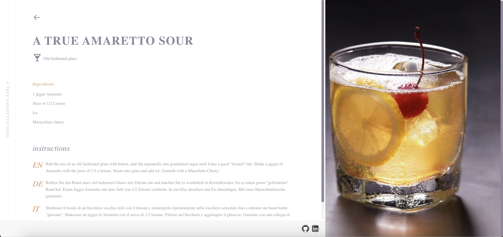

# Cocktail List React App

With this project, you can view the details of the cocktails listed and search by cocktail name.

---

**API:** [Cocktail API](https://www.thecocktaildb.com/)

#### Technologies used in the project:

**React:** I used React Router for redirects and React Icons for icons.
**Redux:** I provided state management with redux. I used createAsyncThunk function to manage asynchronous operations.

---

#### Installations:

1. Verileri çektiğim api base endpoint değerini env dosyası içine yazılıp kaydedilmesi gerekiyor. 
`REACT_APP_API_BASE_ENDPOINT = https://thecocktaildb.com/api/json/v1/1/`
(Eğer kaydettikten sonra hata alıyorsanız projeyi baştan çalıştırın.)
2. Paketleri yüklemek için terminalde **_npm install_** çalıştırın.
3. Projeyi çalıştırmak için **_npm start_** komut dosyasını çalıştırın.

---

**Homepage**

**Cocktail ingredient list pops up when hovering**

**Search**

**Detail Page**

