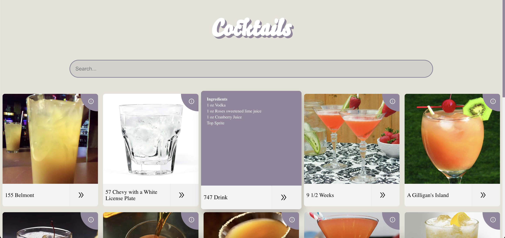

# Cocktail List React App

With this project, you can view the details of the cocktails listed and search by cocktail name.

---

**API:** [Cocktail API](https://www.thecocktaildb.com/)

### Technologies used in the project:

**React:** I used React Router for redirects and React Icons for icons.

**Redux:** I provided state management with redux. I used createAsyncThunk function to manage asynchronous operations.

---

#### Installations:

1. The API base endpoint value from which I pulled the data needs to be written and saved in the env file.
`REACT_APP_API_BASE_ENDPOINT = https://thecocktaildb.com/api/json/v1/1/`
(If you get an error after saving, run the project from the beginning.)
2. Run **_npm install_** in terminal to install the packages.
3. Run the **_npm start_** script to run the project.

---

**Homepage**

**Cocktail ingredient list pops up when hovering**

**Search**

**Detail Page**

